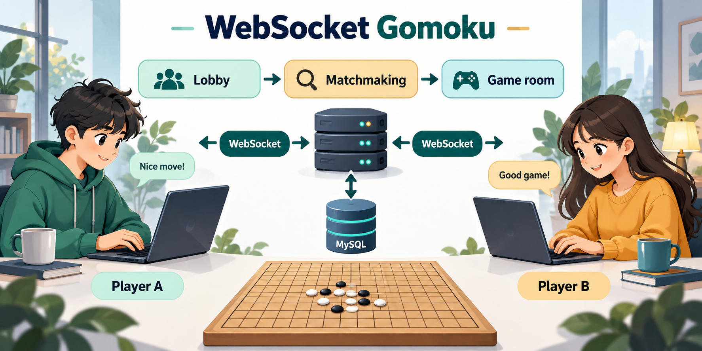
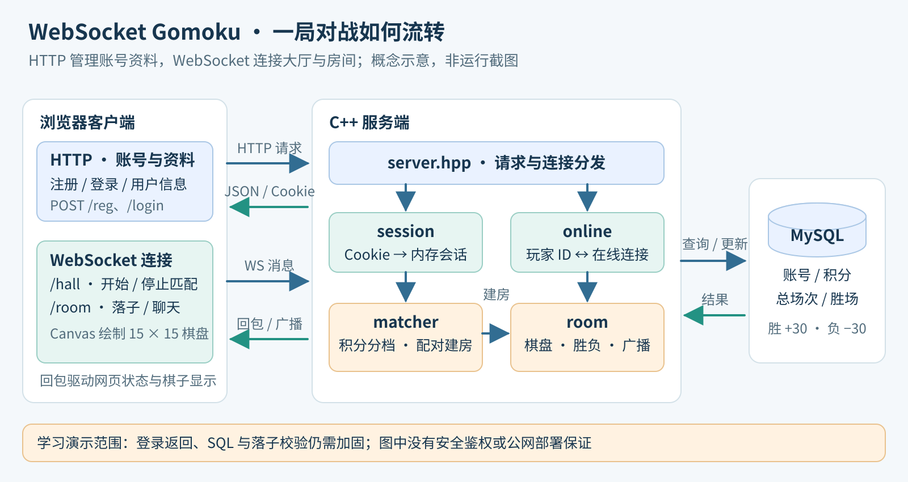

# WebSocket Gomoku · 在线五子棋



一个使用 **C++11、WebSocket++ 和 MySQL C API** 编写的浏览器五子棋学习项目。HTTP 处理注册、登录与用户资料，WebSocket 连接游戏大厅和双人房间，服务端负责匹配、棋盘状态、胜负判定与积分更新。

项目实现了从注册到一局对战结束的基础业务链路，适合学习实时通信、会话管理和模块拆分。当前代码存在已知安全与规则校验缺口，只适合使用测试账号在受控环境演示。

## 已实现的功能

- 浏览器注册、登录，展示积分、比赛场次与获胜场次。
- 游戏大厅开始/停止匹配，按积分分为三个队列：低于 2000、2000–2999、3000 及以上。
- 双人房间与 15 × 15 棋盘，Canvas 绘制棋盘和棋子。
- 横、竖、两个斜方向的五子连珠判定；当前规则为连续不少于五子。
- 房间内聊天、断线判负、结束后返回大厅。
- 新用户初始 1000 分；胜者加 30 分，败者减 30 分，同时更新对局统计。
- 内存会话、在线连接映射、匹配队列和房间生命周期管理。

以上是源码中可确认的能力；不代表已通过当前环境的构建、双客户端联调或压力测试。

## 架构与目录



| 路径 | 职责 |
| --- | --- |
| `src/main.cc` | 程序入口、环境变量配置装配、监听端口 |
| `include/gomoku/config.h` | C/C++ 共用的数据库环境配置与端口检查 |
| `tests/config_test.cpp` | 不连接数据库的配置边界测试 |
| `Makefile` | 根构建入口，可覆盖 MySQL 编译/链接参数 |
| `include/gomoku/server.hpp` | HTTP 与 WebSocket 路由、连接与消息回调 |
| `include/gomoku/db.hpp`、`resources/sql/db.sql` | 用户数据访问与建表脚本 |
| `include/gomoku/session.hpp` | 会话与定时过期管理 |
| `include/gomoku/online.hpp` | 大厅/房间用户 ID 与连接的映射 |
| `include/gomoku/matcher.hpp` | 积分分档、匹配队列与工作线程 |
| `include/gomoku/room.hpp` | 棋盘、落子、胜负、聊天广播与房间管理 |
| `resources/wwwroot/` | 登录、注册、大厅、房间网页及静态资源 |
| `examples/dependencies/` | MySQL、JSON 和 WebSocket 的独立学习实验 |
| `third_party/webbench/` | 仓库附带的 HTTP 压测工具 |

附带 WebBench 不等于已有性能结论；仓库没有提供可复核的五子棋服务压测结果。

## 通信流程

1. 浏览器通过 `POST /reg` 注册，通过 `POST /login` 登录；服务端返回 `SSID` Cookie。
2. 大厅通过 `GET /info` 获取资料，随后连接 `ws://<主机>:8085/hall`。
3. 玩家发送 `match_start` 或 `match_stop`；匹配成功后两人收到 `match_success`。
4. 房间页面连接 `/room`，接收房间号、玩家 ID 与黑白棋身份。
5. 客户端发送 `put_chess` 或 `chat` 消息；服务端更新房间并向双方广播。
6. 连珠或退出触发胜负处理，服务端更新数据库；用户返回大厅开始下一局。

前端目前让白棋先走。服务端还未完整校验轮次，因此该行为依赖网页客户端，见下文限制。

## 构建与运行

### 1. 准备依赖

现有服务端面向 Linux 风格的编译环境，需要：

- 支持 C++11 的 `g++`，以及 `make`（使用原构建文件时）。
- WebSocket++ 头文件。
- Boost.Asio / Boost.System 与 POSIX 线程支持。
- JsonCpp 开发头文件与链接库。
- MySQL 兼容 C API 开发头文件和 `libmysqlclient`。
- 可连接的、支持 SQL `PASSWORD()` 的数据库服务，以及现代浏览器。

**数据库兼容性是启动前提。** 现有注册和登录 SQL 使用 `PASSWORD()`。该函数已从 MySQL 8.0 移除，直接换成 MySQL 8.0 不能保持现有认证 SQL 可用。[MySQL 官方说明](https://dev.mysql.com/doc/refman/8.0/en/mysql-nutshell.html)

MariaDB 文档仍提供该函数，但本项目未给出经联调的数据库版本矩阵，不能据此保证某个版本完整兼容。[MariaDB 函数说明](https://mariadb.com/docs/server/reference/sql-functions/secondary-functions/encryption-hashing-and-compression-functions/password)

### 2. 获取项目并初始化独立测试数据库

```bash
git clone https://github.com/759stronger/websocket-gomoku.git
cd websocket-gomoku
```

**`resources/sql/db.sql` 第一行会执行 `DROP DATABASE IF EXISTS gobang`。只在不含业务数据的独立测试实例中初始化；不要在共享或正式数据库上直接执行。**

核对脚本后，使用有初始化权限的测试数据库账号执行；将 `YOUR_DB_ADMIN` 换成自己的账号，`-p` 会交互输入口令：

```bash
mysql -h 127.0.0.1 -u YOUR_DB_ADMIN -p < resources/sql/db.sql
```

为应用准备仅访问测试 `gobang` 数据库的专用账号。应用业务需要用户表的查询、插入和更新权限，不必沿用源码中的管理员账号。

### 3. 设置数据库环境变量

主服务和独立 MySQL 练习共享 `include/gomoku/config.h`，从环境变量读取连接配置：

| 环境变量 | 要求 / 默认值 |
| --- | --- |
| GOMOKU_DB_HOST | 可省略，默认 127.0.0.1 |
| GOMOKU_DB_USER | 必须非空，使用专用测试账号 |
| GOMOKU_DB_PASSWORD | 必须非空；不会在配置诊断中打印 |
| GOMOKU_DB_NAME | 可省略，默认 gobang |
| GOMOKU_DB_PORT | 可省略，默认 3306；指定时须为 1–65535 的十进制整数 |

在启动进程的终端中配置，例如：

```bash
export GOMOKU_DB_HOST=127.0.0.1
export GOMOKU_DB_USER=YOUR_DEMO_DB_USER
export GOMOKU_DB_PASSWORD="<your-local-password>"
export GOMOKU_DB_NAME=gobang
export GOMOKU_DB_PORT=3306
```

缺失凭据或非法端口会在连接数据库之前退出。配置变更只替换连接参数来源，没有改写注册、登录的 SQL 或业务认证逻辑。不要把真实凭据写回代码或提交到公共仓库；历史版本曾包含硬编码连接配置，若曾实际使用过，应轮换。

### 4. 编译并从项目根目录启动

```bash
make
./build/websocket-gomoku
```

根 Makefile 将头文件列为依赖，但只编译 `src/main.cc`，输出放在 `build/`。默认链接 MySQL C API、JsonCpp、Boost.System 与 pthread。

若 MySQL 头文件或库不在默认搜索路径，可显式传入参数：

```bash
make MYSQL_CPPFLAGS="-I/path/to/mysql/include" \
  MYSQL_LIBS="-L/path/to/mysql/lib -lmysqlclient"
```

服务默认端口仍为 `8085`，静态资源根目录为相对路径 `./resources/wwwroot/`，因此请从项目根目录启动。应用主体仍使用头文件中的实现，各独立程序分别构建，不能把所有示例的入口一起链接。

旧编译产物与原 makefile 只在本地 `artifacts/legacy/` 存档，不纳入新源码提交。完整 Linux 服务构建与双客户端运行尚未复测。

### 5. 验证连接配置（不连接数据库）

在准备好 GNU make 与 C++11 编译器的环境中：

```bash
make config-test
```

测试覆盖缺失用户名/口令、默认值、显式配置、端口边界，以及非法、带符号、含空白、非整数和溢出端口。该测试只修改自身进程的环境变量，不启动服务或访问 MySQL。

当前已用 Windows MSYS2 UCRT g++ 15.2.0 编译并运行这项独立测试，19 项检查均通过；配置头文件也通过 C11 语法检查。Windows 手工命令为：

```powershell
g++ -std=c++11 -Wall -Wextra -pedantic -Iinclude tests/config_test.cpp -o build/config_test.exe
.\build\config_test.exe
```

请先确保 `build/` 存在，并从项目根目录执行。这项验证不代表完整 MySQL/WebSocket 服务已经构建或运行通过。

### 6. 演示一局对战

1. 打开 `http://127.0.0.1:8085/register.html`，注册两个测试账号。
2. 使用两个独立浏览器会话登录 `http://127.0.0.1:8085/login.html`；可使用两个浏览器或普通窗口与隐私窗口，避免共享同一 Cookie。
3. 两个账号进入大厅并点击开始匹配；刚注册的账号会进入同一积分队列。
4. 匹配成功后交替落子，查看双方棋盘同步和聊天。
5. 对局结束后返回大厅，检查积分及对局统计。

如果资料接口失败，先核对数据库连接、`PASSWORD()` 兼容性和初始化结果；如果网页返回 404，核对启动目录和 `resources/wwwroot/`；无法连接时核对端口占用和网络访问条件。

## 已知限制

- **登录结果处理有缺陷。** `server.hpp` 调用数据库登录函数后未保存其返回值，后续检查仍使用 JSON 解析结果；认证失败可能继续创建非预期会话。演示只使用成功注册的测试账号，不可将现有登录流程用于正式认证。
- **落子校验不完整。** 房间服务直接使用客户端传入的 UID、行列值，尚未完整绑定会话身份、检查坐标范围、约束轮次或拒绝已结束棋局的后续操作。自定义请求可能绕过前端规则，异常坐标存在越界访问风险。
- **数据库查询直接拼接输入。** 注册和登录通过 `sprintf` 拼接 SQL，未使用参数化查询且缺少输入长度约束，存在 SQL 注入及固定缓冲区风险；`PASSWORD()` 也不是面向本应用设计的现代密码存储方案。
- **浏览器输出和静态路径处理需加固。** 聊天内容使用 `innerHTML` 渲染，静态文件路径由请求 URI 拼接；尚需补齐输出转义和资源目录边界检查。
- 当前使用非 TLS WebSocket，未实现重连恢复、棋谱持久化、观战、满盘和棋或专业禁手规则。
- 未建立自动测试、持续集成和可靠的并发性能基准；学习用模块接口仍需异常路径和并发安全验证。

## 说明范围

业务功能以原提交 `a808a2e6e4cbc54890f4c4137476cf3b83977959` 为基础，目录和连接配置已按当前源码调整。本次仅验证独立配置单元，没有运行五子棋服务器或数据库。主题图为概念配图，架构图为模块关系示意。

仓库尚未声明统一的项目许可证。附带工具及第三方库可能各有许可证，公开源码不代表可自动按任意开源许可证再发布。
